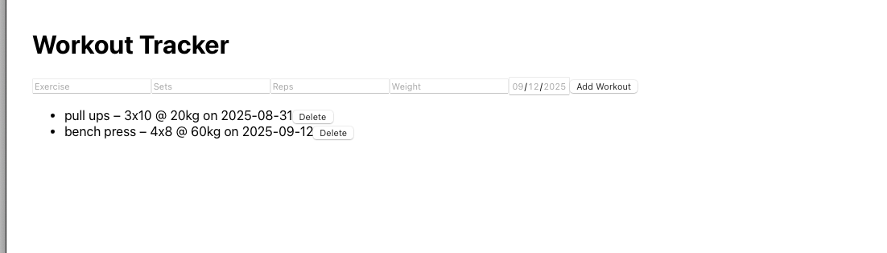
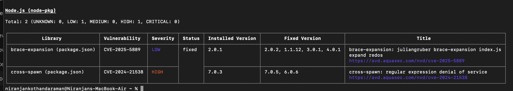
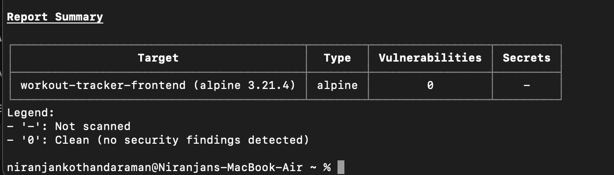

# Workout Tracker (Full-Stack Project)

## Features
- Add/Delete workouts
- Frontend: React
- Backend: Node.js + Express
- Database: SQLite
- Dockerized (runs with docker-compose)

## Run Locally
### Without Docker
- Backend: `cd backend && npm install && node server.js`
- Frontend: `cd frontend && npm install && npm start`

### With Docker
- Make sure Docker is running
- Run: `docker-compose up --build`
- Frontend: http://localhost:3000
- Backend: http://localhost:4000/workouts

GET    /workouts         → returns all workouts
POST   /workouts         → adds a workout (needs exercise, sets, reps, weight, date)
DELETE /workouts/:id     → deletes a workout by id

We ran Trivy vulnerability scans on both the backend and frontend Docker images.
The frontend image (Alpine-based) had 0 vulnerabilities.
The backend image reported one HIGH-severity (cross-spawn) and one LOW-severity (brace-expansion) vulnerability in third-party Node.js dependencies. These do not directly impact our app’s functionality.

Backend Trivy Scan: 
Frontend Trivy Scan: 